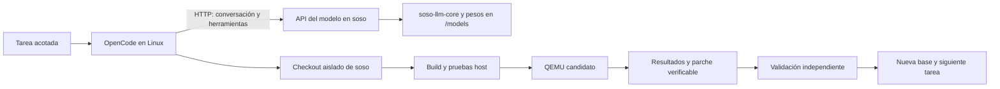

# Automejora de soso con OpenCode y su modelo local

**Fecha:** 15 de septiembre de 2026.  
**Estado:** plan de implementación; hitos SI-0–SI-7 pendientes.  
**Objetivo:** que un agente OpenCode use un modelo servido por el runtime de
soso para leer el proyecto, realizar mejoras pequeñas, compilarlas, probarlas
y acumular mejoras verificadas del propio sistema.

**Subplanes para implementación:** [índice de 44 fichas](docs/self-improvement/README.md),
[contratos compartidos](docs/self-improvement/CONTRATO.md) y
[catálogo de dependencias](docs/self-improvement/tasks.json). Cada ficha fija
contexto mínimo, archivos, pasos, pruebas y cierre.
[T01 — Base reproducible](docs/self-improvement/T01-base.md) está completada
(`scripts/self-improvement/baseline.py`); seguir por
[T02](docs/self-improvement/T02-banco.md) y
[T03](docs/self-improvement/T03-perfil-modelo.md). Las fichas de
ports nativos distinguen investigación, implementación por capacidad e
integración; redactar un inventario no acredita completar un port.

La primera entrega útil ejecutará OpenCode y las herramientas de desarrollo
en Linux, con **la inferencia dentro de soso**. El destino final es trasladar
también el agente y la compilación a soso. Cada traslado tendrá una prueba
independiente: servir un modelo, ejecutar un agente y compilar el sistema son
capacidades distintas.

Aquí «modelo propio» significa pesos instalados en `/models` y ejecutados por
`soso-llm-core`. No presupone entrenar un modelo desde cero. La mejora inicial
afecta al código, las pruebas y el conocimiento operativo de soso; cambiar o
ajustar los pesos será una línea posterior, sometida a evaluaciones separadas.

## 1. Punto de partida comprobado

Inspección del árbol de trabajo actual, que contiene cambios sin commit. Esta
revisión documental no certifica que las suites o el hardware estén en verde.

| Pieza | Qué existe | Qué falta para el objetivo |
|---|---|---|
| Inferencia | [`soso-llm-core`](crates/soso-llm-core), modelos `.som`, tokenización, streaming, CPU y caminos GPU | Validar calidad de programación y herramientas con un modelo real y un contexto útil |
| Modelo residente | [`askd`](user/soso-llm/src/ask.rs), puerto 7420, carga reutilizada entre preguntas | API estructurada, historial, cancelación y aislamiento de peticiones |
| Protocolo de `ask` | Una línea de hasta **1024 bytes**, texto y final `0xFF`; diagnósticos mezclados en la salida | Transportar código multilínea, mensajes y herramientas sin truncamiento ni contaminación |
| Chat | [`chat.rs`](crates/soso-llm-core/src/chat.rs) renderiza `{prompt}` y `{eos}` para una pregunta | Roles, turnos anteriores, esquemas de herramientas y respuestas `tool` |
| Configuración | [`llm.conf`](rootfs/etc/llm.conf), `max=128`, modelo elegido del catálogo si no se fija | Perfil de agente con modelo explícito y límites medidos; fallar si falta ese modelo |
| OpenCode | Binario instalado en el host: **1.18.31**, comprobado con `opencode --version` | Proveedor soso y prueba de integración; no se encontró integración en el código inspeccionado |
| Compilación remota | [`soso-forja-server`](tools/soso-forja-server), árbol de build aislado y cliente guest | Enlazar cada tarea, parche, build y prueba con el mismo identificador |
| Self-hosting | [`docs/SELF-HOSTING.md`](docs/SELF-HOSTING.md): ABI, `soso-std`, editor y Forja | `soso-rustc` sigue siendo un stub; `build-local` copia artefactos; Git nativo y toolchain completa pendientes |
| Verificación | `cargo xtask check`, `cargo xtask test`, suites por subsistema | Banco de tareas de agente y registro de iteraciones reproducibles |
| Recuperación | OTA de kernel con metadatos y backup | Rootfs sin rollback automático de binarios; usar imágenes descartables al principio |

El host dispone además de [`hostrun`](crates/soso-llm-core/examples/hostrun.rs),
útil para depurar el mismo runtime rápidamente. Un resultado allí será una
prueba de desarrollo; el hito de inferencia en soso exigirá ejecución guest.
El [`cuda-proxy`](tools/cuda-proxy) existente delega a `llama-server`: ese
camino puede servir de referencia, pero no acredita inferencia propia en soso.

**Hardware:** consultar los diagnósticos del
[GB205](docs/DIAGNOSTICO-GB205-2026-09-15.md) y de la
[ROG](docs/DIAGNOSTICO-ROG-2026-09-15.md). El primero registra pool VRAM
inutilizable e inferencia en CPU; el segundo registra CE/pool operativos,
pero no evalúa `ask` en esa sesión. Ambos tienen bloqueos WiFi. La evidencia
reciente por equipo prevalece sobre un «GO» histórico de otra configuración.

## 2. Arquitectura y decisiones



- **Un servidor de inferencia estable y un sistema candidato separados.**
  Probar un kernel nuevo no debe apagar el modelo que está ayudando a repararlo.
  Inicialmente podrán ser dos VMs; después, una máquina de inferencia y una VM
  candidata. Reservar RAM/CPU para ambos y serializar builds si compiten.
- **API HTTP compatible con Chat Completions.** OpenCode admite proveedores
  personalizados mediante `@ai-sdk/openai-compatible` y `options.baseURL`.
  Esta es la interfaz elegida para el proyecto.
  [Documentación del proveedor](https://opencode.ai/docs/providers/#custom-provider).
- **Servidor en userspace**, como subcomando propuesto `soso-llm serve`.
  Extraer la gestión reutilizable del modelo desde `askd`; conservar `ask`
  como cliente. El protocolo HTTP tendrá un núcleo compartido `no_std + alloc`
  que se pueda probar en host. Evitar mantener dos cargas del mismo modelo.
- **Una generación activa al principio.** Cola pequeña y limitada; petición
  ocupada o demasiado grande recibe un error explícito. El primer diseño
  reconstruirá el contexto de cada petición; optimizar KV compartida después.
- **OpenCode ejecuta las herramientas.** El servidor genera solicitudes
  estructuradas; el ejecutor del agente lee, edita y lanza pruebas. El runtime
  no ejecutará texto generado como órdenes de shell.
- **CPU es una ruta válida para empezar.** Elegir el modelo más pequeño que
  pase las evaluaciones. La disponibilidad de GPU se decide con medidas del
  equipo, no por el tamaño anunciado de un modelo.

Si HTTP nativo retrasa el primer experimento, un adaptador host podrá traducir
HTTP a un protocolo guest **nuevo, estructurado y con longitud explícita**.
Será temporal y registrará dónde se ejecuta la inferencia. Envolver el `askd`
actual en HTTP no resuelve sus límites de historial, tamaño y herramientas.

## 3. Hoja de ruta y criterios de cierre

### SI-0 — Congelar una base y definir la evaluación

**Dependencias:** ninguna. **Resultado:** una línea base repetible.

- [ ] Crear un checkout de referencia identificado por commit. Si incluye
  cambios actuales, conservar también su diff y archivos nuevos; no borrar
  ni incorporar automáticamente trabajo ajeno.
- [ ] Registrar versión de OpenCode y dependencias del proveedor, toolchain,
  perfil QEMU, recursos y hashes de kernel, pesos, tokenizer y plantilla.
- [ ] Ejecutar las comprobaciones base y conservar sus logs antes de dejar
  al agente editar. Un fallo previo se convierte en una tarea identificada.
- [ ] Preparar 10 microtareas de programación, 10 casos de conversación y
  herramientas, y 5 tareas pequeñas del repositorio con criterio observable.
  Separar ejemplos de desarrollo de casos reservados de evaluación.
- [ ] Medir carga fría, primer token, tokens/s, memoria máxima, longitud de
  contexto efectiva y duración de una petición representativa de OpenCode.

**Cierre:** manifiesto de ejecución, banco versionado y resultados base.
Los casos sintéticos verifican transporte y numérica; la capacidad del agente
se evalúa con pesos reales.

### SI-1 — Conversación y herramientas en el runtime

**Dependencias:** SI-0. **Resultado:** el modelo puede participar en un bucle
`leer → observar resultado → editar → comprobar`.

- [ ] Incorporar una representación de mensajes `system`, `user`,
  `assistant` y `tool`, incluyendo identificadores de llamadas y sus resultados.
- [ ] Implementar primero el formato de conversación de **una familia de
  modelo evaluada**. Verificar tokens especiales, BOS/EOS, fin de turno y
  plantilla contra fixtures de su tokenizer de referencia.
- [ ] Añadir serialización de esquemas de herramientas y parser estricto de
  las llamadas emitidas por esa familia. Validar nombre y argumentos JSON;
  conservar la relación `tool_call_id` entre petición y resultado.
- [ ] Probar llamadas de lectura, edición y ejecución de pruebas. Un bloque
  de código en una respuesta no se interpreta automáticamente como llamada.
- [ ] Manejar respuestas cortadas, JSON inválido y errores de herramienta.
  Si el modelo no sostiene el bucle, ajustar plantilla o elegir otros pesos
  compatibles y repetir la evaluación antes de avanzar.
- [ ] Contar el contexto completo: instrucciones, esquemas, historial,
  archivos y reserva de salida. Probar al menos un caso de 8 Ki tokens si el
  modelo lo admite; si no, documentar el límite y demostrar que cabe la tarea
  real de OpenCode. No anunciar la ventana teórica sin medirla.

**Cierre propuesto:** 10/10 casos de protocolo manejados correctamente y al
menos 8/10 microtareas resueltas, con tres ejecuciones por caso y tasas por
ejecución publicadas. El umbral se fija antes de evaluar; también se conservan
los intentos fallidos.

### SI-2 — Servir el modelo desde soso

**Dependencias:** SI-1. **Resultado:** cliente HTTP externo conectado al
runtime que ejecuta los pesos dentro del guest.

- [ ] Añadir `GET /health`, `GET /v1/models` y
  `POST /v1/chat/completions`, con respuesta completa y streaming SSE
  (eventos enviados progresivamente por HTTP).
- [ ] Implementar el subconjunto que use la versión fijada de OpenCode:
  `model`, `messages`, `tools`, `tool_choice`, `stream`, límites de salida y
  parámetros de muestreo. Rechazar capacidades no soportadas de forma clara.
- [ ] Emitir `id`, `model`, `choices`, contenido o `tool_calls`, motivos de
  finalización (`stop`, `length`, `tool_calls`) y uso de tokens real. Probar
  fragmentación de argumentos en SSE, cierre `[DONE]` y mensajes con
  `content: null` cuando proceda.
- [ ] Separar logs de diagnóstico de la respuesta. Añadir límites de cuerpo,
  contexto, cola y tiempo; validar UTF-8 y JSON aunque TCP los fragmente.
- [ ] Cancelar al desconectarse el cliente y liberar los recursos de esa
  petición. Probar reconexión y dos conversaciones sin mezclar estado.
- [ ] Añadir a `xtask` el reenvío de puerto QEMU, por ejemplo
  `hostfwd=tcp:127.0.0.1:7422-:7422`, configurable para evitar colisiones.
  Comprobar llegada a la NIC y al listener guest; el camino local de `ask`
  no demuestra por sí solo acceso desde el host.
- [ ] Publicar identidad del modelo, build y backend efectivo en diagnósticos
  correlacionados por petición. Si falta el modelo fijado, devolver error.
  Para acceso desde LAN, añadir autenticación y limitar el acceso de red.

**Cierre:** banco HTTP host y prueba en QEMU con modelo real, incluyendo
streaming, herramientas, exceso de contexto, cancelación y recuperación.
Detener el servicio guest debe hacer fallar el cliente; no habrá sustitución
silenciosa por un modelo externo.

### SI-3 — Primera mejora real con OpenCode

**Dependencias:** SI-2. **Resultado:** un parche útil producido por el modelo
de soso, con pruebas y artefactos revisables.

- [ ] Crear la configuración del proveedor y un agente de trabajo acotado.
  Fijar también las llamadas auxiliares —resumen, título o compactación— al
  proveedor soso, o desactivarlas si la versión lo permite. Comprobar tráfico.
- [ ] Ejecutar en un checkout aislado, con instrucciones de arquitectura,
  tarea, rutas pertinentes y criterios de éxito. Cargar contexto por búsqueda
  y lectura de fragmentos; no volcar el repositorio entero al prompt.
- [ ] Reducir inicialmente el catálogo a lectura, búsqueda, edición y
  ejecución de pruebas. Desactivar trabajo delegado para este primer bucle.
- [ ] Resolver una tarea pequeña de userspace o de una crate comprobable en
  host: reproducir el fallo, editar, compilar, interpretar un error y reparar.
- [ ] Validar el parche desde fuera de la sesión del agente y arrancar la
  imagen candidata en QEMU. Guardar entradas/salidas de herramientas y logs.

**Cierre:** una tarea de código real completada de extremo a extremo;
aceptación funcional, checks pertinentes y QEMU en verde. Debe haber llamadas
de herramientas observadas, no solo una explicación textual de la solución.

### SI-4 — Iteraciones que acumulan mejoras

**Dependencias:** SI-3. **Resultado:** un ejecutor repetible de tareas pequeñas.

- [ ] Crear un coordinador externo sencillo que asigne una tarea cada vez,
  prepare el checkout, lance OpenCode y recoja el resultado.
- [ ] Persistir el ciclo:
  `pendiente → reproduciendo → editando → verificando → aceptada/rechazada/bloqueada`.
  Una tarea bloqueada conserva causa, logs y condición para reintentarse.
- [ ] Empezar con límites de 3 intentos de reparación y 30 llamadas a
  herramientas por tarea; fijar además tokens y tiempo máximo según SI-0.
  Detectar repetición sin progreso y terminar con un informe recuperable.
- [ ] Guardar por intento: tarea, base, versión del agente, identidad del
  modelo, parámetros, transcript, diff, comandos, códigos de salida,
  duración, tokens, build candidato y resultado del validador.
- [ ] Reanudar tras un reinicio desde el último estado durable. Antes de
  repetir una acción con efectos, comprobar si ya quedó realizada.
- [ ] Mantener un registro breve de soluciones verificadas y errores
  recurrentes, con enlaces a cambios y pruebas. Recuperar solo las notas
  pertinentes para la siguiente tarea; separar hipótesis de hechos.
- [ ] Promover únicamente parches aceptados a la nueva base. Al cambiar el
  runtime, servidor o pesos del propio agente, conservar la versión anterior
  y repetir el banco reservado antes de sustituirla.

**Cierre propuesto:** 5 mejoras aceptadas en una secuencia de 10 tareas
predefinidas, sin regresiones en la base, más un fallo y un reinicio forzados
con recuperación comprobada. Registrar tasa de éxito, intentos y coste por
mejora aceptada; no contar parches abandonados como mejoras.

### SI-5 — Uso sostenido en hardware real

**Dependencias:** SI-4 y conectividad del equipo validada. **Resultado:** el
servidor del modelo funciona en una instalación física de soso.

- [ ] Seleccionar equipo, modelo y perfil de memoria usando resultados
  reales; repetir SI-1–SI-3 sobre ese servidor.
- [ ] Medir CPU y, cuando esté operativa, GPU: corrección de salida, contexto
  largo, RAM/VRAM, primer token y tiempo por tarea. Arrancar GSP no equivale
  a haber ejecutado correctamente inferencia.
- [ ] Validar la red durante una sesión larga y después de una reconexión.
  Usar Ethernet soportada si está disponible; consultar
  [WIFI-OPERATIVA.md](docs/WIFI-OPERATIVA.md) cuando dependa de WiFi.
- [ ] Mantener pruebas de candidatos en una VM o instalación separada y una
  imagen de recuperación completa. Probar restauración de kernel **y rootfs**
  antes de actualizar automáticamente la máquina que sirve el modelo.

**Cierre:** 10 tareas consecutivas atendidas sin caída del servidor ni fuga
de recursos que impida seguir, con informe por equipo. Documentar por separado
los fallos funcionales del agente y los del transporte o la inferencia.

### SI-6 — Ejecutar OpenCode dentro de soso

**Dependencias:** SI-4; puede investigarse sin esperar SI-5. **Resultado:** el
proceso del agente y sus herramientas de edición viven en soso; el build
puede seguir en Forja remota.

- [ ] Fijar una revisión del código fuente de OpenCode e inventariar sus
  dependencias de ejecución: runtime JavaScript/Bun, bibliotecas nativas,
  almacenamiento, red/TLS, procesos, pipes, terminal y utilidades externas.
  El [repositorio de OpenCode](https://github.com/anomalyco/opencode) será la
  referencia; comprobar dependencias de esa revisión antes de elegir el port.
- [ ] Comparar ese inventario con la ABI de soso y producir una lista
  priorizada de capacidades ausentes. Un ELF Linux empaquetado no acredita
  compatibilidad con la ABI propia de soso.
- [ ] Conseguir primero ejecución sin interfaz interactiva: arranque del
  runtime, HTTP al modelo, persistencia de sesión y una herramienta de lectura.
- [ ] Añadir edición, búsqueda y lanzamiento de procesos con salida y código
  de retorno. Adaptar comandos a `sosh` o aportar las utilidades necesarias.
- [ ] Ejecutar una tarea sobre `/src/soso`, enviar el build a Forja y traer
  sus diagnósticos al agente. Verificar que el artefacto corresponde a esas
  fuentes, no a una copia antigua de `/var/forja-out`.
- [ ] Completar después la terminal interactiva y demás funciones necesarias.

**Cierre:** OpenCode ejecutado como proceso nativo de soso completa el bucle
de una mejora con el modelo local y build remoto. Un controlador ligero
escrito para soso puede ser un puente útil, pero el hito OpenCode nativo
permanece pendiente hasta que se ejecute realmente.

### SI-7 — Cerrar la compilación y actualización nativas

**Dependencias:** SI-6 y toolchain de
[SELF-HOSTING.md](docs/SELF-HOSTING.md). **Resultado:** soso desarrolla una
nueva versión de sí mismo sin un host Linux de compilación.

- [ ] Completar rustc, Cargo, linker, sysroot y dependencias necesarias para
  compilar las crates y herramientas del sistema dentro de soso.
- [ ] Resolver compilación C y ensamblador, incluidas las dependencias de
  `lxdde`, según el perfil objetivo; un build mínimo no certifica todos los
  drivers. Llevar también la generación de imágenes y paquetes al guest.
- [ ] Completar manejo de fuentes y revisiones, pruebas nativas y un destino
  de ensayo independiente. Acreditar cobertura equivalente o documentar los
  checks que siguen requiriendo otra máquina.
- [ ] Ensayar actualización y vuelta a la versión anterior del sistema
  completo con el agente parado o servido por la instancia estable.
- [ ] Repetir varias mejoras usando solo modelo, agente y toolchain en soso;
  conservar hashes y trazabilidad de las versiones producidas.

**Cierre final:** soso genera, valida y arranca una versión mejorada de sí
mismo; el ciclo se repite al menos 3 veces sin edición ni compilación manual
en Linux y con recuperación demostrada de una versión candidata fallida.

## 4. Contrato de una iteración

Cada tarea deberá incluir:

| Campo | Contenido |
|---|---|
| Problema | Síntoma concreto y forma de reproducirlo |
| Base | Commit y perfil de ejecución |
| Alcance | Rutas y tamaño esperado del cambio |
| Aceptación | Comportamiento observable y comprobación independiente |
| Presupuesto | Intentos, herramientas, tokens y tiempo máximo |
| Resultado | Parche, pruebas, logs, artefactos y siguiente estado |

El agente puede editar y ejecutar las pruebas previstas en su copia de
trabajo sin confirmaciones por cada paso. El coordinador aplica la política
de promoción acordada; al principio produce un cambio listo para revisión.
Los builds ejecutan código del repositorio, por lo que el entorno aislado
debe limitar también sus recursos y accesos. Un worktree separa archivos,
pero no constituye aislamiento de procesos.

Los criterios de aceptación y el validador quedan fuera del alcance editable
de la tarea. Si la mejora necesita cambiar pruebas, comprobar el nuevo caso
contra la base: debe detectar el defecto antes de aceptar el arreglo. Para
mejoras de rendimiento, comparar corrección y medidas antes/después bajo el
mismo perfil. El resumen del modelo nunca sustituye al resultado del comando.

OpenCode permite configurar permisos por herramienta y ruta; usarlos para
expresar el alcance del ejecutor. La política concreta se versionará y se
probará con esa versión del agente.
[Documentación de permisos](https://opencode.ai/docs/permissions/).

## 5. Configuración de referencia para SI-3

**Propuesta, todavía no operativa.** Crear `opencode.json` al implementar
SI-3. `soso-coder` será un identificador estable que el servidor resolverá a
unos pesos y plantilla fijados. Los valores 8192/2048 son un perfil inicial
de evaluación; sustituirlos por los límites medidos y reservar la salida
dentro del presupuesto total de contexto.

```json
{
  "$schema": "https://opencode.ai/config.json",
  "model": "soso/soso-coder",
  "small_model": "soso/soso-coder",
  "provider": {
    "soso": {
      "npm": "@ai-sdk/openai-compatible",
      "name": "Modelo local de soso",
      "options": {
        "baseURL": "http://127.0.0.1:7422/v1",
        "apiKey": "{env:SOSO_LLM_API_KEY}"
      },
      "models": {
        "soso-coder": {
          "name": "soso coder",
          "limit": { "context": 8192, "output": 2048 }
        }
      }
    }
  }
}
```

La clave se entrega al cliente y al futuro servidor fuera del repositorio.
Verificar el ejemplo contra el esquema de la versión fijada. Configuración
del adaptador basada en la
[documentación oficial](https://opencode.ai/docs/providers/#custom-provider).
`small_model` fija el modelo de tareas auxiliares, según la
[configuración de modelos](https://opencode.ai/docs/config/#models).

El coordinador podrá invocar, desde el checkout de la tarea:

```sh
opencode run --model soso/soso-coder --format json \
  "Resuelve la tarea descrita en TASK.md y ejecuta sus comprobaciones."
```

`TASK.md` y la política del agente son entradas que preparará el coordinador.
`run`, `--model` y `--format json` están documentados en la
[CLI de OpenCode](https://opencode.ai/docs/cli/#run) y comprobados en la ayuda
del binario local. Esta revisión no lanzó una sesión de inferencia.

## 6. Entregables propuestos y orden inmediato

Las rutas siguientes son propuestas para futuras entregas; este cambio solo
crea el plan.

| Orden | Entregable | Ubicación prevista |
|---|---|---|
| 1 | Manifiesto base, fixtures y banco de tareas | `tests/self-improvement/` |
| 2 | Conversaciones y herramientas por familia | `crates/soso-llm-core/src/chat.rs` y módulos nuevos |
| 3 | Tipos, codec HTTP y eventos comprobables en host | `crates/soso-llm-api/` |
| 4 | Servicio residente y reenvío QEMU | `user/soso-llm/`, `xtask/` |
| 5 | Proveedor y agente acotado | `opencode.json`, `.opencode/` |
| 6 | Coordinador de iteraciones | `tools/soso-improve/` |
| 7 | Historial de ejecuciones y conocimiento verificado | `target/self-improvement/`, `docs/self-improvement/` |

**Siguiente paso concreto:** SI-0, seguido de una prueba SI-1 del modelo real
seleccionado que lea un archivo mediante una herramienta y use su resultado
en el siguiente turno. Esta prueba determina si el cuello de botella es la
calidad del modelo, el formato de chat o la infraestructura del servidor.

Para los cambios de implementación, ejecutar primero pruebas focalizadas;
antes de promover una base, `cargo xtask check` y `cargo xtask test`. Añadir
las suites del subsistema afectado, como `test-update` si cambia OTA. Mantener
actualizadas las skills de dominio y el manual cuando cambien comandos o UX.
El soporte físico se acredita con logs de placa y su matriz, según
[ESTADO.md](docs/ESTADO.md).

**Definición de avance:** SI-3 demuestra utilidad; SI-4 demuestra mejora
acumulativa; SI-5 demuestra operación física; SI-6 y SI-7 eliminan las
dependencias de ejecución y compilación en Linux. Cada cierre adjunta
evidencia reproducible y deja identificados los límites que siguen abiertos.
